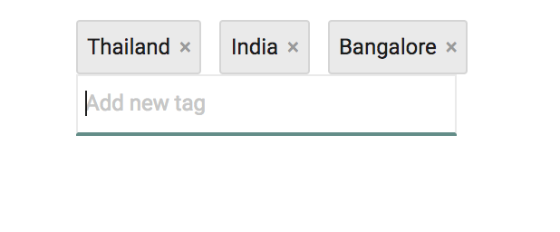
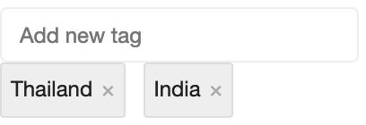
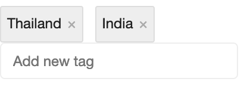

# React tags

[](https://github.com/react-tags/react-tags/blob/master/LICENSE)
[](https://www.npmjs.com/package/react-tag-input)
[](https://www.npmjs.com/package/react-tag-input)
[](https://travis-ci.com/react-tags/react-tags)[](https://github.com/prettier/prettier)
<a href="https://codeclimate.com/github/react-tags/react-tags/maintainability"></a>
<a href="https://codeclimate.com/github/react-tags/react-tags/test_coverage"></a>

React-tags is a simple tagging component ready to drop in your projects. The component is inspired by GMail's *To* field in the compose window.

Follow [@ReactTags](https://twitter.com/ReactTags) on twitter!

## Features
- Autocomplete based on a suggestion list
- Keyboard friendly and mouse support
- Reorder tags using drag and drop

## Why
Started by [Prakhar Srivastav](https://github.com/prakhar1989) and later maintained by [Aakansha Doshi](https://github.com/ad1992).

In Prakhar's words here is why he started it👇🏻

Because I was looking for an excuse to build a standalone component and publish it in the wild? To be honest, I needed a tagging component that provided the above features for my [React-Surveyman](http://github.com/prakhar1989/react-surveyman) project. Since I was unable to find one which met my requirements (and the fact that I generally enjoy re-inventing the wheel) this is what I came up with.


## Demo


Check it out [here](http://www.jinno.io/app/6?source=react-tag-input)

## Support
If you like this library, you can support to help it improve:)

<a href="https://www.buymeacoffee.com/aakansha" target="_blank"></a>


## Installation
You can use npm

```
npm install --save react-tag-input
```

or via Yarn

```js
yarn add react-tag-input
```
make sure you have installed the **peer dependencies** as well with below versions
```
"react": "^17.0.2",
"react-dnd": "^14.0.2",
"react-dnd-html5-backend": "^14.0.0",
"react-dom": "17.0.2"

```
It is, however, also available to be used separately (`dist/ReactTags.min.js`). If you prefer this method remember to include [ReactDND](https://github.com/gaearon/react-dnd) as a dependancy. Refer to the [example](https://stackblitz.com/edit/react-tag-input) to see how this works.

## Usage
    
Here's a sample implementation that initializes the component with a list of initial `tags` and `suggestions` list. Apart from this, there are multiple events, handlers for which need to be set. For more details, go through the [API](#Options).


```javascript
import React from 'react';
import ReactDOM from 'react-dom';
import { WithContext as ReactTags } from 'react-tag-input';

const KeyCodes = {
  comma: 188,
  enter: [10, 13],
};

const delimiters = [...KeyCodes.enter, KeyCodes.comma];

class App extends React.Component {
    constructor(props) {
        super(props);

        this.state = {
            tags: [
                { id: "Thailand", text: "Thailand" },
                { id: "India", text: "India" }
             ],
            suggestions: [
                { id: 'USA', text: 'USA' },
                { id: 'Germany', text: 'Germany' },
                { id: 'Austria', text: 'Austria' },
                { id: 'Costa Rica', text: 'Costa Rica' },
                { id: 'Sri Lanka', text: 'Sri Lanka' },
                { id: 'Thailand', text: 'Thailand' }
             ]
        };
        this.handleDelete = this.handleDelete.bind(this);
        this.handleAddition = this.handleAddition.bind(this);
        this.handleDrag = this.handleDrag.bind(this);
    }

    handleDelete(i) {
        const { tags } = this.state;
        this.setState({
         tags: tags.filter((tag, index) => index !== i),
        });
    }

    handleAddition(tag) {
        this.setState(state => ({ tags: [...state.tags, tag] }));
    }

    handleDrag(tag, currPos, newPos) {
        const tags = [...this.state.tags];
        const newTags = tags.slice();

        newTags.splice(currPos, 1);
        newTags.splice(newPos, 0, tag);

        // re-render
        this.setState({ tags: newTags });
    }

    render() {
        const { tags, suggestions } = this.state;
        return (
            <div>
                <ReactTags tags={tags}
                    suggestions={suggestions}
                    handleDelete={this.handleDelete}
                    handleAddition={this.handleAddition}
                    handleDrag={this.handleDrag}
                    delimiters={delimiters} />
            </div>
        )
    }
};

ReactDOM.render(<App />, document.getElementById('app'));
```

**A note about `Contexts`**
One of the dependencies of this component is the [react-dnd](https://github.com/gaearon/react-dnd) library. Since the 1.0 version, the original author has changed the API and requires the application using any draggable components to have a top-level [backend](http://gaearon.github.io/react-dnd/docs-html5-backend.html) context. So if you're using this component in an existing Application that uses React-DND you will already have a backend defined, in which case, you should `require` the component *without* the context.

```javascript
const ReactTags = require('react-tag-input').WithOutContext;
```
Otherwise, you can simply import along with the backend itself (as shown above). If you have ideas to make this API better, I'd [love to hear](https://github.com/react-tags/react-tags/issues/new).

<a name="Options"></a>
## Options

Option | Type | Default | Description
--- | --- | --- | ---
|[`tags`](#tags) | `Array` | `[]` | An array of tags that are displayed as pre-selected. Here is a [demo](http://www.jinno.io/app/6/tags?source=react-tag-input).|
|[`suggestions`](#suggestions) | `Array` | `[]` | An array of suggestions that are used as basis for showing suggestions. Here is a [demo](http://www.jinno.io/app/6/suggestions?source=react-tag-input).
|[`delimiters`](#delimiters) | `Array` | `[ENTER, TAB]` | Specifies which characters should terminate tags input.
|[`placeholder`](#placeholder) | `String` | `Add new tag` | The placeholder shown for the input. Here is a [demo](http://www.jinno.io/app/6/placeholder?source=react-tag-input).
|[`labelField`](#labelField) | `String` | `text` | Provide an alternative `label` property for the tags. Here is a [demo](http://www.jinno.io/app/6/labelField?source=react-tag-input)
|[`handleAddition`](#handleAddition) | `Function` | `undefined` | Function called when the user wants to add a tag (required).
|[`handleDelete`](#handleDelete) | `Function` | `undefined` | Function called when the user wants to delete a tag (required).
|[`handleDrag`](#handleDrag) | `Function` | `undefined` | Function called when the user drags a tag.
|[`handleFilterSuggestions`](#handleFilterSuggestions) | `Function` | `undefined` | Function called when filtering suggestions.
|[`handleTagClick`](#handleTagClick) | `Function` | `undefined` | Function called when the user wants to know which tag was clicked.
|[`autofocus`](#autofocus) | `Boolean` | `true` | Boolean value to control whether the text-input should be autofocused on mount. Here is a [demo](http://www.jinno.io/app/6/autofocus?source=react-tag-input).
|[`allowDeleteFromEmptyInput`](#allowDeleteFromEmptyInput) | `Boolean` | `true` | Boolean value to control whether tags should be deleted when the 'Delete' key is pressed in an empty Input Box. Here is a [demo](http://www.jinno.io/app/6/allowDeleteFromEmptyInput?source=react-tag-input).
|[`handleInputChange`](#handleInputChange) | `Function` | `undefined` | Event handler for input onChange.
|[`handleInputFocus`](#handleInputFocus) | `Function` | `undefined` | Event handler for input onFocus.
|[`handleInputBlur`](#handleInputBlur) | `Function` | `undefined` | Event handler for input onBlur.
|[`minQueryLength`](#minQueryLength) | `Number` | `2` | How many characters are needed for suggestions to appear. Here is a [demo](http://www.jinno.io/app/6/minQueryLength?source=react-tag-input).
|[`removeComponent`](#removeComponent) | `Function` |  | Function to render custom remove component for the tags.
|[`autocomplete`](#autocomplete) | `Boolean`/`Number` | `false` | Ensure the first matching suggestion is automatically converted to a tag when a [delimiter](#delimiters) key is pressed. Here is a [demo](http://www.jinno.io/app/6/autocomplete?source=react-tag-input).
|[`readOnly`](#readOnly) | `Boolean` | `false` | Read-only mode without the input box and `removeComponent` and drag-n-drop features disabled. Here is a [demo](http://www.jinno.io/app/6/readOnly?source=react-tag-input).
|[`name`](#name) | `String` | `undefined` | The `name` attribute added to the input . Here is a [demo](http://www.jinno.io/app/6/name?source=react-tag-input).
|[`id`](#id) | `String` | `undefined` | The `id` attribute added to the input . Here is a [demo](http://www.jinno.io/app/6/id?source=react-tag-input).
|[`maxLength`](#maxLength) | `Number` | `Infinity` | The `maxLength` attribute added to the input. Here is a [demo](http://www.jinno.io/app/6/maxLength?source=react-tag-input).
|[`inline`](#inline) | `Boolean` | `true` | Render input field and selected tags in-line. Here is a [demo](http://www.jinno.io/app/6/inline?source=react-tag-input).
|[`inputFieldPosition`](#inputFieldPosition) | `String` | `inline` | Specify position of input field relative to tags
|[`allowUnique`](#allowUnique) | `Boolean` | `true` | Boolean value to control whether tags should be unqiue. Here is a [demo](http://www.jinno.io/app/6/allowUnique?source=react-tag-input).
|[`allowDragDrop`](#allowDragDrop) | `Boolean` | `true` | Boolean value to control whether tags should have drag-n-drop features enabled. Here is a [demo](http://www.jinno.io/app/6/allowDragDrop?source=react-tag-input).
|[`renderSuggestion`](#renderSuggestion) | `Function` | `undefined` | Render prop for rendering your own suggestions.
| [`inputProps`](#inputProps) | Object |`{}` | The extra attributes which are passed to the input field. 

### tags 
An array of tags that are displayed as pre-selected. Each tag should have an `id` property, property for the label, which is specified by the [`labelField`](#labelFieldOption) and class for label, which is specified by `className`.

```js
// With default labelField
const tags =  [ { id: "1", text: "Apples" } ]

// With labelField of `name`
const tags =  [ { id: "1", name: "Apples" } ]

// With className
const tags = [ { id: "1", text: "Apples", className: 'red'} ]
```
Here is a [demo](http://www.jinno.io/app/6/tags?source=react-tag-input).

### suggestions
An array of suggestions that are used as basis for showing suggestions. These objects should follow the same structure as the `tags`. So if the `labelField` is `name`, the following would work:

```js
// With labelField of `name`
const suggestions = [
    { id: "1", name: "mango" },
    { id: "2", name: "pineapple"},
    { id: "3", name: "orange" },
    { id: "4", name: "pear" }
];

```
Here is a [demo](http://www.jinno.io/app/6/suggestions?source=react-tag-input).

### delimiters
Specifies which characters should terminate tags input. An array of character codes.

```js
const Keys = {
    TAB: 9,
    SPACE: 32,
    COMMA: 188,
};
<ReactTags
    delimiters={[Keys.TAB, Keys.SPACE, Keys.COMMA]}
 />
```

### placeholder
The placeholder shown for the input.

```js
let placeholder = "Add new country"
```
Here is a [demo](http://www.jinno.io/app/6/placeholder?source=react-tag-input).

### labelField
Provide an alternative `label` property for the tags.

```jsx
<ReactTags
    tags={tags}
    suggestions={}
    labelField={'name'}
    handleDrag={}
 />
```

This is useful if your data uses the `text` property for something else.
Here is a [demo](http://www.jinno.io/app/6/labelField?source=react-tag-input).

### handleAddition
Function called when the user wants to add a tag (either a click, a tab press or carriage return)

```js
function(tag) {
    // add the tag to the tag list
}
```
### handleDelete
Function called when the user wants to delete a tag

```js
function(i) {
    // delete the tag at index i
}
```
### handleDrag
If you want tags to be draggable, you need to provide this function.
Function called when the user drags a tag.

```js
function(tag, currPos, newPos) {
    // remove tag from currPos and add in newPos
}
```

### handleFilterSuggestions
To assert control over the suggestions filter, you may contribute a function that is executed whenever a filtered set
of suggestions is expected. By default, the text input value will be matched against each suggestion, and [those that
**start with** the entered text][default-suggestions-filter-logic] will be included in the filters suggestions list. If you do contribute a custom filter
function, you must return an array of suggestions. Please do not mutate the passed suggestions array.

For example, if you prefer to override the default filter behavior and instead match any suggestions that contain
the entered text _anywhere_ in the suggestion, your `handleFilterSuggestions` property may look like this:

```js
function(textInputValue, possibleSuggestionsArray) {
    var lowerCaseQuery = textInputValue.toLowerCase()

    return possibleSuggestionsArray.filter(function(suggestion)  {
        return suggestion.toLowerCase().includes(lowerCaseQuery)
    })
}
```

Note: The above custom filter uses `String.prototype.includes`, which was added to JavaScript as part of the ECMAScript 7
specification. If you need to support a browser that does not yet include support for this method, you will need to
either refactor the above filter based on the capabilities of your supported browsers, or import a [polyfill for
`String.prototype.includes`][includes-polyfill].


### handleTagClick
Function called when the user wants to know which tag was clicked

```js
function(i) {
    // use the tag details at index i
}
```

### autofocus
Optional boolean param to control whether the text-input should be autofocused on mount.

```jsx
<ReactTags
    autofocus={false}
    ...>
```
Here is a [demo](http://www.jinno.io/app/6/autofocus?source=react-tag-input).

### allowDeleteFromEmptyInput
Optional boolean param to control whether tags should be deleted when the 'Delete' key is pressed in an empty Input Box.

```js
<ReactTags
    allowDeleteFromEmptyInput={false}
    ...>
```
Here is a [demo](http://www.jinno.io/app/6/allowDeleteFromEmptyInput?source=react-tag-input).

### handleInputChange
Optional event handler for input onChange

```js
<ReactTags
    handleInputChange={this.handleInputChange}
    ...>
```

### handleInputFocus
Optional event handler for input onFocus

```js
<ReactTags
    handleInputFocus={this.handleInputFocus}
    ...>
```


### handleInputBlur
Optional event handler for input onBlur

```js
<ReactTags
    handleInputBlur={this.handleInputBlur}
    ...>
```

### minQueryLength
Minimum number of characters needed for suggestions to appear. Defaults to `2`.

Here is a [demo](http://www.jinno.io/app/6/minQueryLength?source=react-tag-input).

### removeComponent
If you'd like to supply your own tag delete/remove element, create a React component and pass it as a property to ReactTags using the `removeComponent` option. By default, a simple anchor link with an "x" text node as its only child is rendered, but if you'd like to, say, replace this with a `<button>` element that uses an image instead of text, your markup may look something like this:

```javascript
import {WithContext as ReactTags} from 'react-tag-input'

class Foo extends React.Component {
   render() {
      return <ReactTags removeComponent={RemoveComponent}/>
   }
}

class RemoveComponent extends React.Component {
   render() {
     const { className, onRemove } = this.props;
      return (
         <button onClick={onRemove} className={className}>
            
         </button>
      )
   }
}
```
The below props will be passed to the `removeComponent`. You will need to forward the relevant props to your custom remove component to make it work.

| Name | Type  | Description |
| --- | ---  | --- |
| `className` | `string`  | The prop `classNames.remove` passed to the `ReactTags` component gets forwarded to the remove component. Defaults to `ReactTags__remove` |
| `onRemove` | `Function` | The callback to be  triggered when tag is removed, you will need to pass this to the `onClick` handler of the remove component |
|`onKeyDown` | `Function` | The callback to be triggered when keydown event occurs. You will need to pass this to `onKeyDown` handler of the remove component|
| `aria-label` | string | The `aria-label` to be announced when the tag at an index is deleted |
| `tag` | <pre>{ id?: string, className: string, key: string }</pre> | The `tag` to be deleted.
| `index` | number | the `index` of the tag to be deleted.


### autocomplete
Useful for enhancing data entry workflows for your users by ensuring the first matching suggestion is automatically converted to a tag when a [delimiter](#delimiters) key is pressed (such as the enter key). This option has three possible values:

- `true` - when delimeter key (such as enter) is pressed, first matching suggestion is used.
- `1` - when delimeter key (such as enter) is pressed, matching suggestion is used only if there is a single matching suggestion
- `false` (default) - tags are not autocompleted on enter/delimiter

This option has no effect if there are no [`suggestions`](#suggestionsOption).
Here is a [demo](http://www.jinno.io/app/6/autocomplete?source=react-tag-input).

### readOnly
Renders the component in read-only mode without the input box and `removeComponent`. This also disables the drag-n-drop feature.

Here is a [demo](http://www.jinno.io/app/6/readOnly?source=react-tag-input).

### name
The name attribute added to the input.

```
<ReactTags
    name = "inputName"
    ...>
```
Here is a [demo](http://www.jinno.io/app/6/name?source=react-tag-input).

### id
The id attribute added to the input.

```
<ReactTags
    id = "inputId"
    ...>
```
Here is a [demo](http://www.jinno.io/app/6/id?source=react-tag-input).


### maxLength
The maxLength attribute added to the input. Specifies the maximum number of characters allowed in the input field.

```
<ReactTags
    maxLength = "42"
    ...>
```
Here is a [demo](http://www.jinno.io/app/6/maxLength?source=react-tag-input).

### inline
The inline attributes decides whether the input fields and selected tags will be rendered in-line.

```
<ReactTags
    inline
    ...>
```


```
<ReactTags
    inline={false}
    ...>
```



_This attribute is deprecated and will be removed in v7.x.x, see [inputFieldPosition](#inputFieldPosition)._
Here is a [demo](http://www.jinno.io/app/6/inline?source=react-tag-input).

### inputFieldPosition
The inputFieldPosition attribute decides the positioning of the input field relative to the tags. Can be one of `inline`, `top` or `bottom`.

```
<ReactTags
    inputFieldPosition="inline"
    ...>
```


```
<ReactTags
    inputFieldPosition="top"
    ...>
```



```
<ReactTags
    inputFieldPosition="bottom"
    ...>
```



Here is a [demo](http://www.jinno.io/app/6/inputFieldPosition?source=react-tag-input).

### allowUnique 
This prop controls whether tags should be unique.
Here is a [demo](http://www.jinno.io/app/6/allowUnique?source=react-tag-input).

### allowDragDrop
This prop controls whether tags should have the drag-n-drop feature enabled.

Here is a [demo](http://www.jinno.io/app/6/allowDragDrop?source=react-tag-input).

### renderSuggestion
This props allows to provide your own suggestion renderer and override the default one. It receives the suggestion and the query string as parameters. For example:

```
<ReactTags
    renderSuggestion = {({ text }, query) => <div style={{ textDecoration: 'underline', textDecorationStyle: 'wavy' }}>{text} ({ query })</div>}
    ...>
```

### inputProps

When you want to pass additional attributes to the input element (for example autocomplete, disabled etc) you can use this prop. 

```js
<ReactTags
  inputProps = {{
    disabled: true,
    autocomplete: "off"
  }}
/>
```

## Styling
`<ReactTags>` does not come up with any styles. However, it is very easy to customize the look of the component the way you want it. By default, the component provides the following classes with which you can style -

- `ReactTags__tags`
- `ReactTags__tagInput`
- `ReactTags__tagInputField`
- `ReactTags__selected`
- `ReactTags__selected ReactTags__tag`
- `ReactTags__selected ReactTags__remove`
- `ReactTags__suggestions`
- `ReactTags__activeSuggestion`

An example can be found in `/example/reactTags.css`.

If you need to set your own class names on the component, you may pass in
a `classNames` prop.

```js
  <ReactTags
    classNames={{
      tags: 'tagsClass',
      tagInput: 'tagInputClass',
      tagInputField: 'tagInputFieldClass',
      selected: 'selectedClass',
      tag: 'tagClass',
      remove: 'removeClass',
      suggestions: 'suggestionsClass',
      activeSuggestion: 'activeSuggestionClass'
    }}
    ...>
```


## Dev
The component is written in ES6 and uses [Webpack](http://webpack.github.io/) as its build tool.

## Set up instructions

```
git clone git@github.com:react-tags/react-tags.git
cd react-tags
npm install
npm run precommit
npm run start
```
open [http://localhost:8090/example](http://localhost:8090/example)


## Contributing
Got ideas on how to make this better? Open an issue!


## Thanks
The autocomplete dropdown is inspired by Lea Verou's [awesomeplete](https://github.com/LeaVerou/awesomplete) library. The Drag and drop functionality is provided by Dan Abramov's insanely useful [ReactDND](https://github.com/gaearon/react-dnd) library.

Also thanks to the awesome contributors who've made the library far better!


[default-suggestions-filter-logic]: https://github.com/react-tags/react-tags/blob/v4.0.1/lib/ReactTags.js#L83
[includes-polyfill]: https://github.com/mathiasbynens/String.prototype.includes
